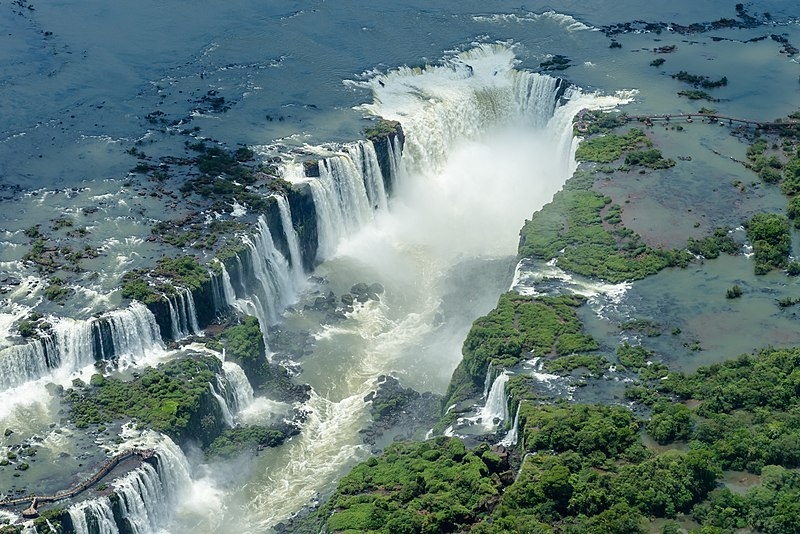
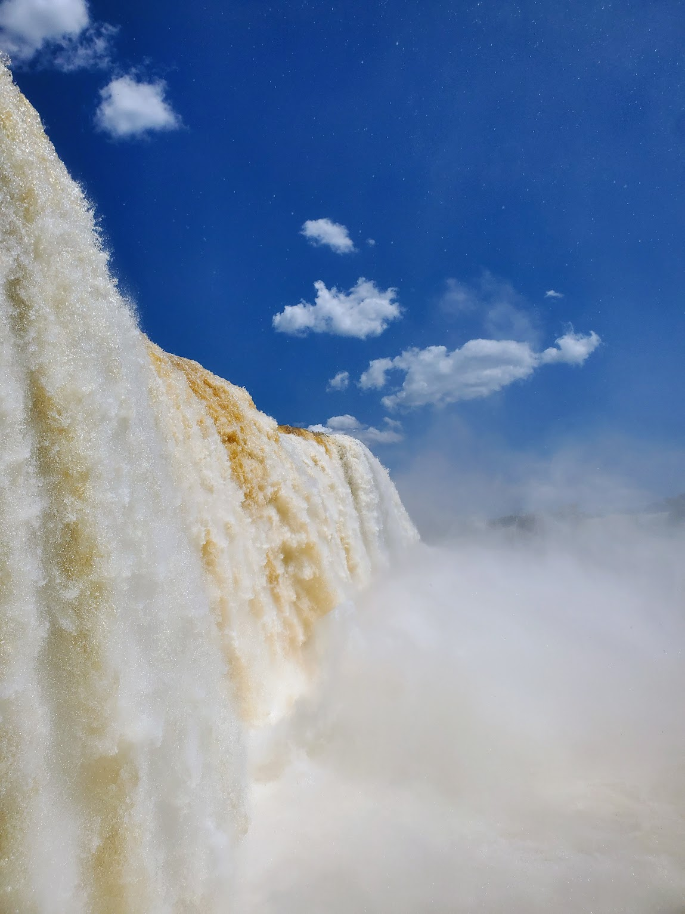

I hope that one day, you will have the chance to visit the Iguazu Falls. It’s simply grande. I remember walking and walking and walking and all across me is water. All I can hear is the water crashing and roaring across the forest. A friend told me, “It’s just so much water … I feel if I’m under it, it could crush me in seconds.” 

But when I was there, I also noticed the water is brown. I wondered out loud to my friends on a few occasions, but like most, quickly assumed that it’s the natural color of the falls. That is, until I found the truth on an unassuming board at the corner of the boardwalk as we were walking across the fall, hidden in plain sight. 

Turns out, the water isn’t supposed to be brown. 

Up until recently, the Iguazu Falls used to have a natural blue color. Due to illegal deforestation in the area nearby, there are no more tree roots to hold the soil in the ground. So the soil gets washed away by the water, turning it into a murky brown. So extensive is the destruction that the entire Iguazu Falls now has this brown color. And the consequence is not just in its aesthetic. Local aquatic wildlife is struggling because of the disturbance from the soil.
\
\
\
\
Sometimes I forget the scale of human destruction.

As I looked at the falls again, I wonder: How is it that the most grande waterfall of the world, in all of its beauty and glory, still cannot escape our evils? 

How is it that we seek out to destroy the very thing that we then pay for to see? 

How is it that, like so many tourists walking past that sign could just continue with their life completely oblivious, how is it that we can keep our eyes closed by our own destruction, and carry on as usual?

The human greed knows no ends. 

I cried a lot that day. I grieved for the waterfall, for the animals, the trees. I grieved for the beauty that we have lost, for a planet that is screaming in pain right in front of my eyes, yet no one else even seems to notice. 

—-

We think of climate change as something distant. A century away, perhaps. A degree of warming, maybe two? Something that our grandchildren or children would need to deal with. But if we really, really look, it’s already here. It’s embedded in the hotter summers, the longer heat waves, the more frequent wildfires. It’s in the spread of the COVID pandemic, and its origin. It’s in rallying cries of the climate scientists and the more dire and dire warnings each year. It’s in the news of millions of climate refugees that get brushed away as we scroll to another TikTok. 

It’s in the brown color of the Iguazu Falls.

—-

I delayed writing and publishing this because I don’t know what is the action item here. To talk more about climate change? To vote? To be vegan? To change your career and work on climate? To protest?

All I know is I cannot be silent with this raging pain. We cannot continue to see the world like this, with our eyes closed, our ears shut. We cannot see our Earth bleeds then go on with our days. Not like this. 

—-

Tomorrow, I will get up and be ready to fight. Tomorrow, I will work on climate. Tomorrow, I will be positive about the endless possibilities and believe that we can all work on it together, and maybe, that glimmer of hope can turn into reality. 

But today, just today, let me grieve for Iguazu. 

***Credits to Tianhui Xu, Aniket Das and Wikipedia for the photos.***