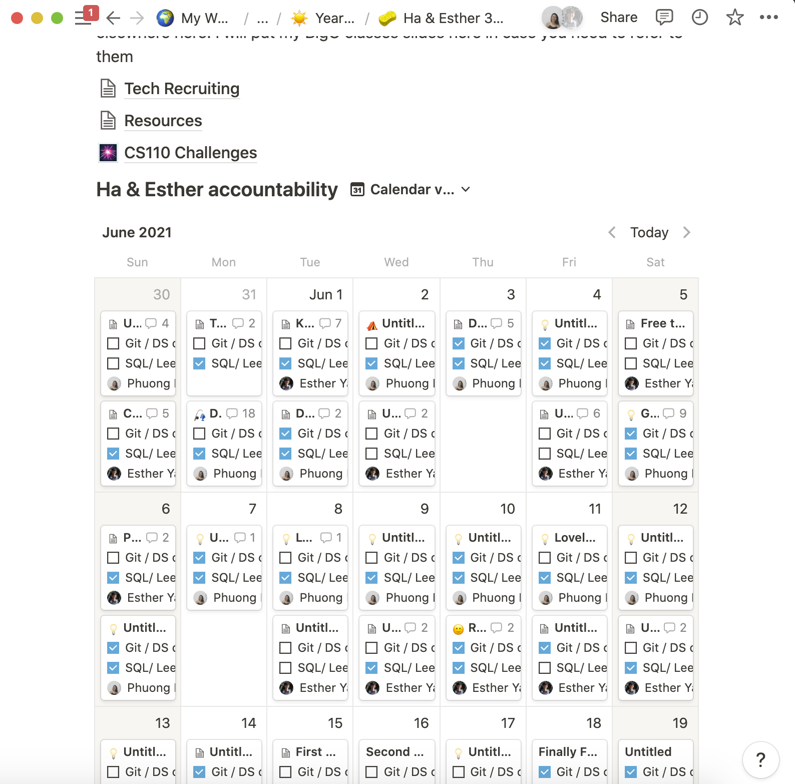
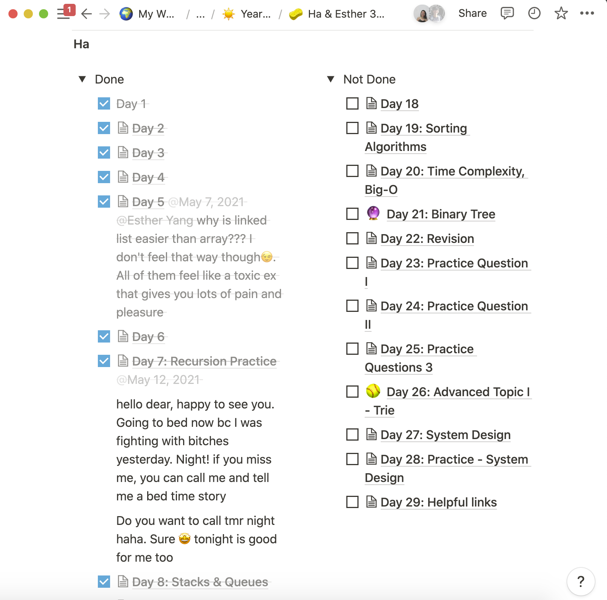
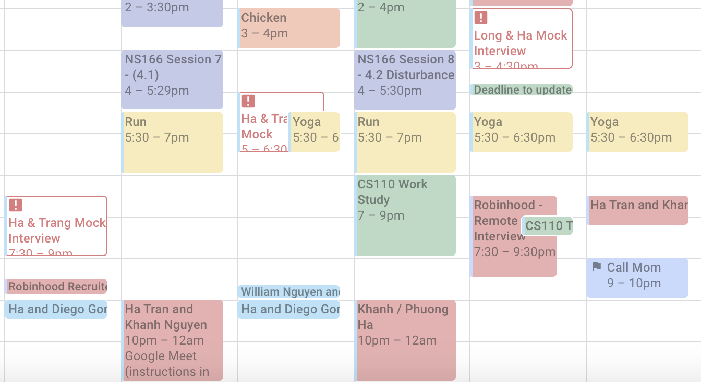

You can hate data structure and algorithms all you want, but at the end of the day, if you want a job at a big tech company, you will need it. If you are preparing for the interviews, this is what I've learnt from my personal experience that has got me 5 different internship offers.

## Mindset
Enjoy Leetcode. I'm serious! I don't think Leetcode is a chore - I actually think of them as brain teasers and try to have fun when doing them. This is an important mindset - without it you can't get through the grind. So learn to enjoy the process!

## Foundation
Make sure you get a solid foundation in Data Structure and Algorithm before practicing.
In my school curriculum we didn't learn linked lists, stacks, queues, dfs, bfs, etc. So before I started Leetcoding I spent a month just to get myself familiar with all these concepts. 
If you are lucky enough that your school covered everything, be sure to revisit them and learn the runtime and space complexity. Remember the Big O!

## Practice
It started with a 30-day coding challenge with my friend.

This is extremely useful because I can be very inconsistent, which means I would be motivated for 3 days and then stopped my progress. Having my friend who checked in on me daily motivated me to keep my momentum going. 
However, since my friend is doing Data Science, I need a separate system for my practice. I simply duplicated the Notion page from [Engineering with Utsav](https://www.youtube.com/watch?v=7UlslIXHNsw) which had over 200 questions, and started practicing from their. His system is incredible because it uses pseudo-space repetition as you would revisit questions that you don't remember first, and practice more regularly. 

A few things I've learnt from this process:
1. Be consistent. Do 5 questions a day - if you can't - do 3 - or do 1. Whatever it is, try to be consistent with it. 
    - Coding is like building muscle. You can't be in the gym for 8 hours for 1 day and expect to build muscles. It's the same with coding.
2. But! Quality over quantity. It's better to do a question 3 times than 3 questions 1 time. Remember, interviewer doesn't want to know how many questions you have solved, only whether you can solve their problem. Make sure that, for every question that you met, if you revisit it again some time later, you can solve it.
3. If you get stuck for 5 minutes, take a peek at the solution/ general approach. If you get stuck for another 5, read the answers, learn how they approach it, implement it yourself, and remember to revisit it later. Don't try to struggle too hard, instead, look for ways to improve your answers/ try out different approaches.
6. Stick to 1 language and practice it. Preferably Python because it is short and that saves you time when you're coding. But learn the syntax inside out, know where to import heap, stack, queue, how to create a class if needed, and so on. 
7. Read other people's answers! You will learn so much from them. And take note not just how they approach it, but also their code syntax, code structure, etc.

## Mock interviews
I started mock interviews pretty early. I had a few friends who were also preparing for technical interview, so we just started interviewing with each other. This is extremely useful because it teaches you to verbalize your thought process, ask good clarifying questions, practice with questions you have not seen before, and get comfortable with the process. For me, there was an added benefit as I can be inconsistent, so having mock interviews forced me to practice regularly. At one point, I had roughly 5 mock interviews a week.

A few tips:
1. Ideally, you want to have people who would do it regularly with you, because that way, you would teach each other. If neither of you have had mocks before, either 1. Get someone who has done mocks before to do it with you (so you know the structure) or 2. Watch a Youtube video of people doing mock interviews/ tips and tricks. 
2. Learn to get good feedback and give good feedbacks. What are the things that were good about the other person's code structure/ way of thinking? How can you incorporate that more?
3. But! Mock interviews are not a substitution for doing Leetcode questions on your own. You can perfect asking clarifying questions and looking for edge cases and testing your code, but if you can't code a solution, that's it. 

## Other tips I've learnt along the way
1. Find good explanations.
This is harder than you think. I've read probably 10 different articles explaining DP before I found one where I read and finally felt like I got it. I was also scouring the Internet on "How to do binary search and its variations"TM and couldn't found those for a while (only to stumble on them by accident). You will know when you find them: it's like before you were trying to memorize code, but now you have the tools to come up with the answer on your own. 
    Where I find good explanations: Leetcode Discuss, HackerNoon 14 patterns.
2. Build mental models, such as:
    Interviewing process:
        - How would I approach the questions? (Ask clarifying edge case > Go through Pseudocode > Code up solution > Runtime complexity > Test case)
        - What clarifying question would I ask? 
    Approaching questions:
        - What type of data structure and algorithm should I use?
        - How to approach specific type of question. If it's a Tree traversal for instance, is it pre-order, in-order or post-order? 
3. Be proactive! While I do think it's difficult to find quality resources, they still exist! And hopefully, if you go through enough resources, you can find them. When I started pivoting to software engineering, my Youtube feed was basically just Computer Science, and I would reach out to everyone I know who was a SWE to ask for advice (and a bunch of people that I don't know too :)). Even if you don't know a lot from 1 person, if 5 people say something over and over again, then you have to follow that advice!

## Final reminder
Your progress is not linear. What happens as you approach more and more problems, is the existing mental models become more robust, and you learn new ones in the process. It's actually exponential - it takes time to set up, but once you get going, it can accelerate really fast. I can feel the progress myself as I did all of the above.

That's it. You got this! Good luck 🍀